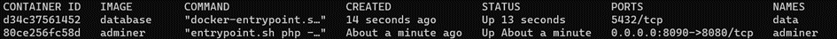
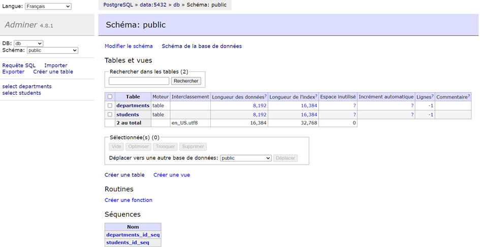
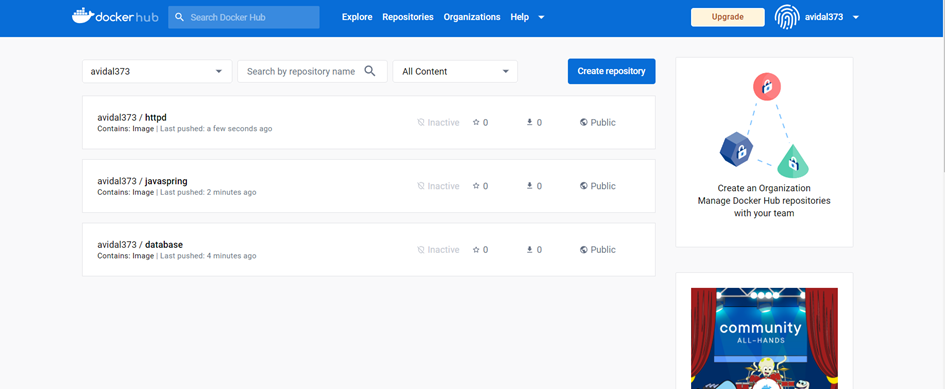
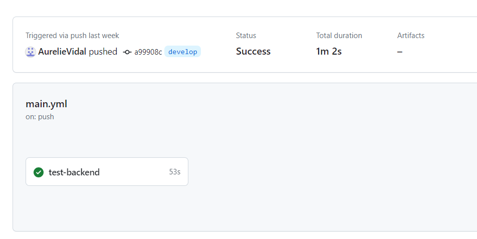
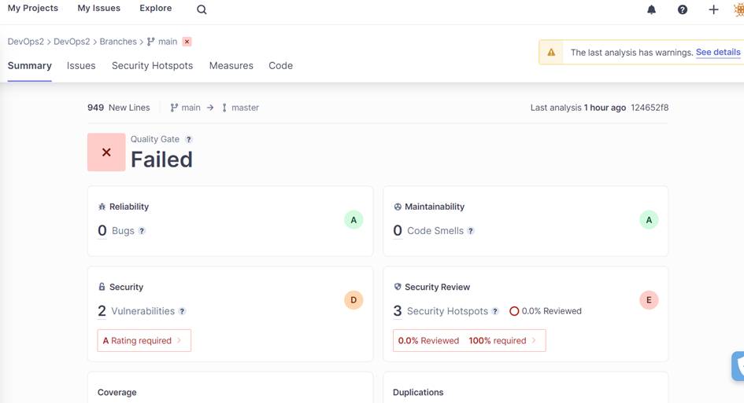
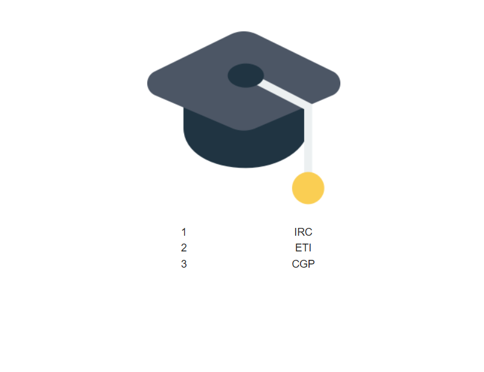

# DevOps


DevOps est un ensemble de pratiques qui met l'accent sur la collaboration et la communication entre les développeurs de logiciels et les professionnels des opérations informatiques. Il repose sur les principes suivants :
-	Automatisation : pour rendre le processus de développement et de déploiement plus efficace en remplaçant les actions humaines par des scripts et des outils automatisés.
-	Everything As Code : des éléments, qu'il s'agisse de l'infrastructure, des configurations, des politiques ou des processus, est géré et documenté de la même manière que le code source d'une application. En adoptant cette approche, les équipes peuvent versionner, suivre et gérer tous les aspects de leur infrastructure et de leurs processus comme s'ils s'agissaient de code, garantissant ainsi une reproductibilité et une traçabilité optimales.
-	Bonnes pratiques de craftsmanship : elles font référence à l'application de normes et de principes de qualité dans le développement logiciel. Cela inclut des concepts tels que la modularité, la documentation exhaustive, la révision du code, la gestion des tests et l'attention portée à la maintenabilité et à la lisibilité du code. 

Le but de ce TP est de déployer sur un serveur une application 3-tiers, composée d'une base de données, d'un serveur HTTP et d'un backend. Pour y parvenir, nous utiliserons différents outils. Tout d'abord, Docker sera employé pour encapsuler l'application dans un conteneur, suivi de GitHub Actions, qui assurera la compilation, les tests et le déploiement automatique de l'application (CI/CD). Enfin, nous ferons appel à Ansible, un outil de gestion de configuration, pour provisionner et configurer un serveur pour l'application.


## TP1 : Docker

### 1-1 Document your database container essentials: commands and Dockerfile.

Voici le Dockerfile du conteneur de la base de données, situé dans le fichier ./Database : 
```
# Utilisation de l'image de base PostgreSQL en version 14.1-alpine
FROM postgres:14.1-alpine

# Définition des variables d'environnement pour la configuration de la base de données
ENV POSTGRES_DB=db \
   POSTGRES_USER=usr \
   POSTGRES_PASSWORD=pwd

# Copie des fichiers "CreateScheme.sql" et "InsertData.sql" dans le répertoire d'initialisation de la base de données
# Lorsque le conteneur PostgreSQL démarre, ces scripts SQL permettront créer le schéma initial de la base de données et d'y insérer les insérer des données initiales
COPY CreateScheme.sql /docker-entrypoint-initdb.d/
COPY InsertData.sql /docker-entrypoint-initdb.d/

```

Pour lancer ce conteneur, nous utilisons les commandes suivantes : 

1.	``docker network create app-network``
Dans un premier temps, on crée un réseau Docker. Le conteneurs qui y seront connectés pourront communiquer entre eux en utilisant les noms de conteneur comme hôtes.

2.	``docker build -t database .``
Cette commande permet de contruire l'image Docker que l'on nomme database avec le Dockerfile ci-dessus, présent dans le répertoire courant.


3.	``docker run -p "8090:8080" --net=app-network --name=adminer -d adminer``
Cette commande permet de lancer un conteneur Adminer qu'on connecte au réseau Docker créé précedemment. On mappe le port 8080 du conteneur sur le port 8090 de l'hôte, ce qui siginfie qu'on peut accéder à Adminer via localhost:8090. Le conteneur de base de donnée peut parfaitement tourner sans Adminer, mais Adminer nous permet de visualiser la database.

4.	``docker run -d --network app-network --name data database``
Cette commande permet de lancer un conteneur Docker à partir de l'image database qui a été construite précedemment.On connecte également ce conteneur au réseau Docker créé précedemment pour qu'il puisse communiquer avec Adminer


Après avoir effectué ces commandes, on a bien les deux conteneurs qui tournent : 



En allant sur localhost:8090, on voit que Adminer a bien récupéré les informations de la base de données



### 1-2 Why do we need a multistage build? And explain each step of this dockerfile.

Le multi-stage build consiste à utiliser plusieurs instructions FROM dans le même Dockerfile. Chaque instruction FROM peut utiliser une base différente, et chacune d'entre elles commence une nouvelle étape de la construction.

Dans le contexte de notre backend Java Spring, pour le faire fonctionner correctement, deux étapes essentielles sont requises : la compilation et l'exécution de l'application. Le multistage build se révèle particulièrement avantageux dans ce scénario, car il permet de réaliser ces deux étapes cruciales au sein d'un seul Dockerfile. Cela simplifie le processus de création de l'image Docker en combinant ces étapes, offrant ainsi une approche plus efficace pour déployer et gérer notre application Java Spring dans des conteneurs.

Voici comment se compose le Dockerfile : 
```
# Build
FROM maven:3.8.6-amazoncorretto-17 AS myapp-build

# Définition de la variable d'environnement pour le répertoire de l'application
ENV MYAPP_HOME /opt/myapp

# Configuration du répertoire de travail
WORKDIR $MYAPP_HOME

# Copie du fichier pom.xml pour gérer les dépendances
COPY pom.xml .

# Copie du code source de l'application
COPY src ./src

# Exécution de la commande Maven pour construire l'application (avec exclusion des tests)
RUN mvn package -DskipTests

# Run
FROM amazoncorretto:17

# Réutilisation de la variable d'environnement pour le répertoire de l'application
ENV MYAPP_HOME /opt/myapp

# Configuration du répertoire de travail pour la phase d'exécution
WORKDIR $MYAPP_HOME

# Copie du fichier JAR généré dans l'étape précédente de construction
COPY --from=myapp-build $MYAPP_HOME/target/*.jar $MYAPP_HOME/myapp.jar

# Configuration de l'entrée principale pour exécuter l'application Java
ENTRYPOINT java -jar myapp.jar

```

Pour lancer le conteneur, il suffit alors de faire : 
```
docker build -t javaspring .
docker run -p 8080:8080 javaspring
```
Cette commande permet d'afficher 'Hello World!' en console.


### 1-3 Document docker-compose most important commands. 

Voici les principales commander de docker compose : 
- ``docker-compose up`` : Démarre tous les services définis dans le fichier docker-compose.yml. Si le fichier n'est pas spécifié, Docker Compose utilisera le fichier docker-compose.yml par défaut.

- ``docker-compose up -d`` : Démarre tous les services en arrière-plan (en mode détaché).

- ``docker-compose down``: Arrête et supprime tous les conteneurs, réseaux et volumes associés à l'application.

- ``docker-compose ps`` : Affiche l'état des conteneurs de l'application.

- ``docker-compose logs`` : Affiche les journaux des conteneurs en cours d'exécution.

- ``docker-compose exec <service_name> <command>`` : Exécute une commande dans le conteneur du service spécifié.

- ``docker-compose build`` : Construit ou reconstruit les images des services, en utilisant le Dockerfile spécifié.

- ``docker-compose restart <service_name>`` : Redémarre un service spécifique.

- ``docker-compose stop <service_name>`` : Arrête un service spécifique sans le supprimer.

- ``docker-compose start <service_name>`` : Démarre un service spécifique.

- ``docker-compose pull`` : Met à jour les images des services en téléchargeant les dernières versions depuis le registre.

- ``docker-compose config`` : Vérifie la validité du fichier docker-compose.yml et affiche la configuration fusionnée.

- ``docker-compose down -v`` : Arrête et supprime tous les conteneurs, réseaux, volumes et images associés à l'application.

- ``docker-compose up --scale <service_name>=<num_instances>`` : Démarre plusieurs instances d'un service.

- ``docker-compose pause`` : Met en pause tous les services de l'application.

- ``docker-compose unpause`` : Reprise de tous les services de l'application.

### 1-4 Document your docker-compose file.

Le fichier docker-compose.yml du projet permet de lancer des conteneurs à partir des Dockerfiles qui on été créé dans chaque partie (database, backend et serveur HTTP).

Les dockerfile de la base de données et du backend ont été expliqués précédemment. La partie serveur HTTP consiste à rediriger les requêtes recues vers le backend via un reverse proxy configuré de cette façon : 
```
<VirtualHost *:80>
ProxyPreserveHost On
ProxyPass / http://back:8080/
ProxyPassReverse / http://back:8080/
</VirtualHost>
LoadModule proxy_module modules/mod_proxy.so
LoadModule proxy_http_module modules/mod_proxy_http.so
```
Ce fichier de configuration permet de configurer un proxy inversé pour rediriger le trafic entrant du port 80 vers un autre serveur (conteneur back) fonctionnant sur le port 8080.

Le Dockerfile du serveur HTTP est le suivant : 
```
# Ce Dockerfile est basé sur l'image officielle d'Apache HTTP Server.
FROM httpd

# Copie le fichier de configuration personnalisé depuis le répertoire local de construction
COPY ./httpd.conf /usr/local/apache2/conf/httpd.conf
```

A partir des trois Dockerfile, on peut alors créer le fichier docker-compose.yml : 
```
version: '3.7'  # Version de la syntaxe Docker Compose utilisée.

services:  # Définition des services de l'application.
    backend:  # Service "backend".
        build: ./Backend_API/simple-api-student  # Construction de l'image à partir du répertoire source.
        container_name: back  # Nom du conteneur personnalisé.
        networks:
          - app-network  # Connexion au réseau "app-network".
        depends_on:
          - database  # Attend le démarrage du service "database" avant de démarrer.

    database:  # Service "database".
        build: ./Database  # Construction de l'image à partir du répertoire source.
        container_name: data  # Nom du conteneur personnalisé.
        networks:
          - app-network  # Connexion au réseau "app-network".

    httpd:  # Service "httpd".
        build: ./HTTP_Server  # Construction de l'image à partir du répertoire source.
        container_name: httpd  # Nom du conteneur personnalisé.
        ports:
          - "80:80"  # Mappage du port 80 du conteneur sur le port 80 de l'hôte.
        networks:
          - app-network  # Connexion au réseau "app-network".
        depends_on:
          - backend  # Attend le démarrage du service "backend" avant de démarrer.

networks:  # Définition des réseaux utilisés.
    app-network:  # Réseau "app-network" pour connecter les conteneurs de l'application.
```

Une fois le fichier docker-compose.yml créé, il nous suffit d'exécuter la commande ``docker compose up``. Un fois que tous les conteneurs tournent, on peut aller à l'adresse http://localhost/departments/IRC/students : 

```
[
  {
    "id": 1,
    "firstname": "Eli",
    "lastname": "Copter",
    "department": {
      "id": 1,
      "name": "IRC"
    }
  }
]
```
La réponse obtenue estbien un json contenant l'ensemble des élèves du département IRC, tout fonctionne correctement.

### Document your publication commands and published images in dockerhub.


Pour publier une image sur dockerhub, il suffit d'exécuter ces trois commandes :
```
docker build -t database .
docker tag database avidal373/database:1.0
docker push avidal373/database:1.0
```
Ici, on veut publier l'image de la base de données. ``docker build -t database .``  construit  dans un premier temps une image Docker nomée database à partir du Dockerfile présent dans le dossier Database (d'où la commande est effectuée). Ensuite, ``docker tag database avidal373/database:1.0`` permet de créer un tag pour une image Docker existante. Elle prend l'image "database" créée précédemment et lui ajoute un nouveau tag "avidal373/database:1.0". Enfin, ``docker push avidal373/database:1.0`` permet d'envoyer l'image "avidal373/database:1.0" vers un Docker Hub pour la rendre disponible pour d'autres utilisateurs ou pour le déploiement sur d'autres systèmes.

On fait ensuite de même avec les Dockerfile du backend et du serveur HTTP : 
```
docker build -t javaspring .
docker tag javaspring avidal373/javaspring:1.0
docker push avidal373/javaspring:1.0

docker build -t httpd .
docker tag httpd avidal373/httpd:1.0
docker push avidal373/httpd:1.0

```

Ainsi, en se connectant sur Docker Hub, on retrouve bien les images qu'on vient de publier :



## TP2 : Github Action

### 2-1 What are testcontainers?

On retruver les testcontainers dans le fichier pom.xml de notre backend utilisant Maven. Ce fichier contient la configuration des dépendances nécessaires pour notre application, dont les testcontainers : 
```
<dependency>
    <groupId>org.testcontainers</groupId>
    <artifactId>testcontainers</artifactId>
    <version>${testcontainers.version}</version>
    <scope>test</scope>
</dependency>
<dependency>
    <groupId>org.testcontainers</groupId>
    <artifactId>jdbc</artifactId>
    <version>${testcontainers.version}</version>
    <scope>test</scope>
</dependency>
<dependency>
    <groupId>org.testcontainers</groupId>
    <artifactId>postgresql</artifactId>
    <version>${testcontainers.version}</version>
    <scope>test</scope>
</dependency>
```
Testcontainers, est une bibliothèque permettant de gérer des conteneurs Docker pour les tests unitaires et d'intégration. Avec Testcontainers, nous pouvons démarrer des conteneurs Docker temporaires, tels que des bases de données, pour exécuter nos tests de manière isolée et reproductible.
1.	``org.testcontainers:testcontainers`` : Il s'agit de la bibliothèque principale de Testcontainers, elle fournit l'infrastructure pour gérer les conteneurs Docker pendant les tests.
2.	``org.testcontainers:jdbc`` :  Cette dépendance prend en charge la gestion des bases de données JDBC au sein de Testcontainers. Elle permet de créer et gérer facilement des conteneurs pour des bases de données telles que MySQL, PostgreSQL (notre cas), et d'autres, puis nous connecter à ces conteneurs pour tester les interactions de l'application avec la base de données.
3.	``org.testcontainers:postgresql`` : Cette dépendance spécifique est destinée à la gestion des conteneurs de bases de données PostgreSQL au sein de Testcontainers. Elle permet de créer une base de données PostgreSQL dans un conteneur Docker pour tester les interactions de l'application avec PostgreSQL.

## 2-2 Document your Github Actions configurations.

Voici le contenu f=du fichier main.yml, situé dans le répertoire .github/workflows : 
```
name: CI devops 2023  # Nom du workflow GitHub Actions

on:
  push:
    branches:
      - main
      - develop
  pull_request:  # Le workflow est déclenché sur les pushes vers les branches "main" et "develop" ainsi que sur les pull requests

jobs:  # Définition des différents jobs dans le workflow

  test-backend:  # Premier job : Tester le backend
    runs-on: ubuntu-22.04  # Exécution sur Ubuntu 22.04
    
    steps:
      - uses: actions/checkout@v2.5.0  # Récupération du code depuis le dépôt

      - name: Set up JDK 17  # Configuration de JDK 17
        uses: actions/setup-java@v3
        with:
          java-version: 17
          distribution: 'adopt'

      - name: Build and test with Maven  # Construction et test du projet avec Maven
        run: mvn clean verify
        working-directory: Backend_API/simple-api-student  # Répertoire du projet
```   
Ce fichier représente la configuration d'un workflow GitHub Actions nommé "CI devops 2023". Il est déclenché par des pushes sur les branches "main" et "develop", ainsi que par les pull requests. Le workflow contient un job appelé "test-backend" qui s'exécute sur une machine Ubuntu 22.04. Dans ce job, le code est récupéré depuis le dépôt, le JDK 17 est configuré, puis le projet est construit et testé avec Maven dans le répertoire "Backend_API/simple-api-student". 
En résumé, ce workflow automatisé est conçu pour tester le backend d'une application à chaque push ou pull request, assurant ainsi une validation continue du code.

Pour vérifier si la pipeline fonctionne, il suffit donc de push notre projet sur un répertoire github. En allant dans la section Actions, on obtient : 

On peut voir que le job a bien été exécuté avec succès, ce qui signifie que le backend fonctionne bien.

On peut maintenant ajouter un deuxième job qui va cette fois construire et publier des images docker : 
```
name: CI devops 2023  # Nom du workflow GitHub Actions

on:
  # Déclenchement du workflow sur les événements suivants
  push:
    branches: 
      - main
      - develop
  pull_request:
  workflow_run:
      workflows:
        - Preflight
      types:
        - completed

jobs:
  test-backend: 
    runs-on: ubuntu-22.04  # Exécution sur une machine Ubuntu 22.04
    steps:
      - uses: actions/checkout@v2.5.0  # Récupération du code depuis le dépôt

      - name: Set up JDK 17  # Configuration de JDK 17
        uses : actions/setup-java@v3
        with : 
          java-version : 17
          distribution : 'adopt'

      - name: Build and test with Maven  # Construction et test du projet avec Maven
        run: mvn clean verify
        working-directory: Backend_API/simple-api-student  # Répertoire du projet

  build-and-push-docker-image:
    needs: test-backend  # Dépend du travail "test-backend"
    runs-on: ubuntu-22.04  # Exécution sur une machine Ubuntu 22.04
    steps:
      - name: Checkout code
        uses: actions/checkout@v2.5.0

      - name: Login to DockerHub  # Connexion à DockerHub
        run: docker login -u ${{ secrets.DOCKERHUB_USERNAME }} -p ${{ secrets.DOCKERHUB_TOKEN }}

      - name: Build image and push backend  # Construction et publication de l'image "backend"
        uses: docker/build-push-action@v3
        with:
          context: ./Backend_API/simple-api-student
          tags:  ${{secrets.DOCKERHUB_USERNAME}}/backend:latest
          push: ${{ github.ref == 'refs/heads/main' }}

      - name: Build image and push database  # Construction et publication de l'image "database"
        uses: docker/build-push-action@v3
        with:
          context: ./Database
          tags:  ${{secrets.DOCKERHUB_USERNAME}}/database:latest
          push: ${{ github.ref == 'refs/heads/main' }}

      - name: Build image and push httpd  # Construction et publication de l'image "httpd"
        uses: docker/build-push-action@v3
        with:
          context: ./HTTP_Server
          tags:  ${{secrets.DOCKERHUB_USERNAME}}/http:latest
          push: ${{ github.ref == 'refs/heads/main' }}

      - name: Build image and push front  # Construction et publication de l'image "front"
        uses: docker/build-push-action@v3
        with:
          context: ./devops-front-main
          tags:  ${{secrets.DOCKERHUB_USERNAME}}/front:latest
          push: ${{ github.ref == 'refs/heads/main' }}
```


## 2-3 Document your quality gate configuration.

Pour utiliser Sonar, on modifie la dernière task du premier job : 
```
  - name: Build and test with Maven
    run: mvn -B verify sonar:sonar -Dsonar.projectKey=devops2aurelievidal_devops2 -Dsonar.organization=devops2aurelievidal -Dsonar.host.url=https://sonarcloud.io -Dsonar.login=${{ secrets.SONAR_TOKEN }}  --file ./Backend_API/simple-api-student/pom.xml
```
Dans le test du backend, on va analyser le code source du projet à l'aide de SonarCloud pour évaluer la qualité du code. Les résultats de cette analyse sont envoyés à SonarCloud pour une évaluation plus approfondie de la qualité du code.
Une fois connecté à SonarCloud, on retrouve bien l'évaluation de la qualité du code : 



## TP3 : Ansible

### 3-1 Document your inventory and base commands

Dans un premier temps, nous avons créé un inventory.
Dans Ansible, un inventory est un fichier (ou un ensemble de fichiers) qui répertorie les hôtes sur lesquels on souhaite effectuer des opérations de gestion et d'automatisation à l'aide d'Ansible. L'inventory est un élément essentiel de l'architecture d'Ansible, car il indique à Ansible où se trouvent les systèmes distants, comment s'y connecter et quelles opérations doivent être effectuées sur ces systèmes.
Dans notre cas les inventories se situent dans le répertoire /ansible/inventories du projet. Nous y avons créé le fichier setup.yml suivant : 
```
# Définition du groupe d'inventaire principal "all"
all:
 vars:
   # Spécification de l'utilisateur SSH à utiliser pour se connecter aux hôtes
   ansible_user: centos
   # Chemin vers la clé privée SSH à utiliser pour les connexions SSH
   ansible_ssh_private_key_file: /home/aurel/id_rsa
 children:
   # Création d'un groupe d'enfants "prod"
   prod:
     # Liste des hôtes ou groupes d'hôtes inclus dans le groupe "prod"
     hosts: aurelie.vidal92.takima.cloud

```
Pour vérifier si tout fonctionne bien, on peut effectuer un ping sur tous les hôtes répertoriés dans le setup.yml, dans notre cas aurelie.vidal92.takima.cloud, via la commande ``ansible all -i inventories/setup.yml -m ping``.
On obtient la réponse suivante : 
```
aurelie.vidal92.takima.cloud | SUCCESS => {
    "ansible_facts": {
        "discovered_interpreter_python": "/usr/bin/python"
    },
    "changed": false,
    "ping": "pong"
}
```
Le ping a fonctionné, on a donc bien accès au serveur.


On va ensuite utiliser les facts. Les facts se réfèrent aux données collectées automatiquement sur les systèmes distants pendant l'exécution de tâches ou de playbooks. Ces données fournissent des informations détaillées sur les propriétés et la configuration des systèmes cibles, ce qui permet une gestion et une automatisation plus précises. 

On peut collecter les facts avec la commande ``ansible all -i inventories/setup.yml -m setup -a "filter=ansible_distribution*"``. La réponse obtenue est : 
```
aurelie.vidal92.takima.cloud | SUCCESS => {
    "ansible_facts": {
        "ansible_distribution": "CentOS",
        "ansible_distribution_file_parsed": true,
        "ansible_distribution_file_path": "/etc/redhat-release",
        "ansible_distribution_file_variety": "RedHat",
        "ansible_distribution_major_version": "7",
        "ansible_distribution_release": "Core",
        "ansible_distribution_version": "7.9",
        "discovered_interpreter_python": "/usr/bin/python"
    },
    "changed": false
}
```
On retrouve bien les informations importante sur le serveur aurelie.vidal92.takima.cloud : la distribution, si elle a été analysé avec succès, le chemin ou se situe le fichier de la distribution, le type de la distribution, la version et le chemin vers l'interpréteur python.

Enfin, la commande ``ansible all -i inventories/setup.yml -m yum -a "name=httpd state=absent" --become`` permet de désinstaller le package "httpd" sur tous les hôtes répertoriés dans l'inventaire "setup.yml".

### 3-2 Document your playbook

Notre playbook dédié à l'installation de Docker se situe dans le répertoire ansible du projet. Afin de simplifier le playbook, on utilise des rôles créés à l'aide de la commande ``ansible-galaxy init roles/docker``. Cette commande permet de créer un rôle nomé docker dans le répertoire /ansible/roles. On peut trouver dans le fichier /ansible/roles/docker/tasks un fichier main.yml dans lequel nous pouvons ajouter l'esemble des tâches nécéssaires à l'installation de Docker : 
```
- name: Update yum packages
  command:
    cmd: yum update
    # Cette tâche met à jour les packages du système en utilisant YUM

- name: Install device-mapper-persistent-data
  yum:
    name: device-mapper-persistent-data
    state: latest
    # Cette tâche installe le package "device-mapper-persistent-data" en utilisant YUM, en veillant à ce qu'il soit à sa version la plus récente

- name: Install lvm2
  yum:
    name: lvm2
    state: latest
    # Cette tâche installe le package "lvm2" en utilisant YUM, en veillant à ce qu'il soit à sa version la plus récente

- name: Add Docker repository
  command:
    cmd: sudo yum-config-manager --add-repo=https://download.docker.com/linux/centos/docker-ce.repo
    # Cette tâche ajoute le référentiel Docker à la configuration YUM

- name: Install Docker
  yum:
    name: docker-ce
    state: present
    # Cette tâche installe le package Docker "docker-ce" en utilisant YUM, en veillant à ce qu'il soit présent

- name: Install python
  yum:
    name: python3
    state: present
    # Cette tâche installe le package Python "python3" en utilisant YUM, en veillant à ce qu'il soit présent

- name: Install docker
  pip:
    name: docker
    executable: pip3
  vars:
    ansible_python_interpreter: /usr/bin/python3
    # Cette tâche utilise pip pour installer le module Python "docker", en spécifiant l'interpréteur Python à utiliser

- name: Make sure Docker is running
  service:
    name: docker 
    state: started
    tags: docker
    # Cette tâche s'assure que le service Docker est en cours d'exécution en utilisant le module service, elle est étiquetée avec "docker"
```

On peut alors appeler le role dans notre playbook : 
```
- hosts: all
  gather_facts: false
  become: true
  roles:
    - docker
```
Dans un premier temps, on définit l'ensemble d'hôtes sur lesquels ces tâches seront exécutées. "all" signifie que cela s'applique à tous les hôtes de l'inventaire.
Puis, on désactive la collecte des facts sur les hôtes avant l'exécution du playbook. Cela signifie que les informations sur les systèmes cibles ne seront pas collectées.
Enfin, on indique que ce playbook utilisera le rôle nommé "docker". 

### 3-3 Document your docker_container tasks configuration

Comme nous l'avons fait avec docker, on crée les roles correspondant aux différentes parties de l'application : 
- role network, pour créer un réseau Docker : 
```
- name: Create a network
  docker_network:
    name: app-network
    # Utilisation du module "docker_network" pour créer le réseau Docker.

  vars:
    ansible_python_interpreter: /usr/bin/python3
    # Définition de l'interpréteur Python utilisé
```
- role database, pour lancer le conteneur Docker de la base de données : 
```
- name: Launch database
  docker_container:
    name: data
    image: avidal373/database:latest
    pull: true
    recreate: true
    networks: 
      - name: app-network
  vars:
    ansible_python_interpreter: /usr/bin/python3

```
Ici, on utilise le module "docker_container" pour lancer le conteneur.L'option "name: data" spécifie le nom du conteneur, qui sera appelé "data". L'option "image: avidal373/database:latest" spécifie l'image Docker à utiliser pour le conteneur, avec "latest" indiquant la dernière version de l'image.L'option "pull: true" indique de tirer l'image si elle n'existe pas localement.L'option "recreate: true" indique de recréer le conteneur s'il existe déjà.La section "networks" spécifie que le conteneur est attaché au réseau "app-network".

- role back, pour lancer le conteneur Docker du backend : 
```
- name: Launch back
  docker_container:
    name: back
    image: avidal373/backend:latest
    pull: true
    recreate: true
    networks: 
      - name: app-network
      
  vars:
    ansible_python_interpreter: /usr/bin/python3
```
De la même manière que le role database, on crée un conteneur appelé back utilisant l'image Docker avidal373/backend:latest.

- role http, pour lancer le conteneur Docker du serveur HTTP : 
```
- name: Launch http server
  docker_container:
    name: httpd
    image: avidal373/http:latest
    pull: true
    recreate: true
    networks: 
      - name: app-network
    ports:
      - "80:80"
  vars:
    ansible_python_interpreter: /usr/bin/python3
```
Comme précedemment, on crée un conteneur appelé httpd utilisant l'image Docker avidal373/http:latest. On expose également le port 80, en faisant correspondre le port 80 du conteneur avec le port 80 de l'hôte.

- role front, pour lancer le conteneur Docker du front : 
```
- name: Launch front
  docker_container:
    name: front
    image: avidal373/front:latest
    pull: true
    recreate: true
    networks: 
      - name: app-network
    ports:
      - "8081:80"
  vars:
    ansible_python_interpreter: /usr/bin/python3
```
Encore une fois, on crée un conteneur appelé front utilisant l'image Docker avidal373/front:latest. 


On peut alors ajouter les roles créées dans le playbook :
```
- hosts: all
  gather_facts: false
  become: true
  roles:
    - docker
    - network
    - database
    - back
    - front
    - http
```
Pour exécuter le playbook, on utilise la commande ``ansible-playbook -i inventories/setup.yml playbook_docker.yml``

Dans la réponse, on peut alors voire que l'ensemble des tâches s'exécutent correctement : 
```
PLAY [all] *************************************************************************************************************

TASK [docker : Update yum packages] ************************************************************************************
[WARNING]: Consider using the yum module rather than running 'yum'.  If you need to use command because yum is
insufficient you can add 'warn: false' to this command task or set 'command_warnings=False' in ansible.cfg to get rid
of this message.
changed: [aurelie.vidal92.takima.cloud]

TASK [docker : Install device-mapper-persistent-data] ******************************************************************
ok: [aurelie.vidal92.takima.cloud]

TASK [docker : Install lvm2] *******************************************************************************************
ok: [aurelie.vidal92.takima.cloud]

TASK [docker : Add Docker repository] **********************************************************************************
[WARNING]: Consider using 'become', 'become_method', and 'become_user' rather than running sudo
changed: [aurelie.vidal92.takima.cloud]

TASK [docker : Install Docker] *****************************************************************************************
ok: [aurelie.vidal92.takima.cloud]

TASK [docker : Install python] *****************************************************************************************
ok: [aurelie.vidal92.takima.cloud]

TASK [docker : Install docker] *****************************************************************************************
ok: [aurelie.vidal92.takima.cloud]

TASK [docker : Make sure Docker is running] ****************************************************************************
ok: [aurelie.vidal92.takima.cloud]

TASK [network : Create a network] **************************************************************************************
ok: [aurelie.vidal92.takima.cloud]

TASK [database : Launch database] **************************************************************************************
[DEPRECATION WARNING]: The container_default_behavior option will change its default value from "compatibility" to
"no_defaults" in community.general 3.0.0. To remove this warning, please specify an explicit value for it now. This
feature will be removed from community.general in version 3.0.0. Deprecation warnings can be disabled by setting
deprecation_warnings=False in ansible.cfg.
[DEPRECATION WARNING]: Please note that docker_container handles networks slightly different than docker CLI. If you
specify networks, the default network will still be attached as the first network. (You can specify purge_networks to
remove all networks not explicitly listed.) This behavior will change in community.general 2.0.0. You can change the
behavior now by setting the new `networks_cli_compatible` option to `yes`, and remove this warning by setting it to
`no`. This feature will be removed from community.general in version 2.0.0. Deprecation warnings can be disabled by
setting deprecation_warnings=False in ansible.cfg.
changed: [aurelie.vidal92.takima.cloud]

TASK [back : Launch back] **********************************************************************************************
changed: [aurelie.vidal92.takima.cloud]

TASK [front : Launch front] ********************************************************************************************
changed: [aurelie.vidal92.takima.cloud]

TASK [http : Launch http server] ***************************************************************************************
changed: [aurelie.vidal92.takima.cloud]

PLAY RECAP *************************************************************************************************************
aurelie.vidal92.takima.cloud : ok=13   changed=6    unreachable=0    failed=0    skipped=0    rescued=0    ignored=0
```

Si on va sur http://aurelie.vidal92.takima.cloud/, on peut voir que tout fonctionne correctement : 


